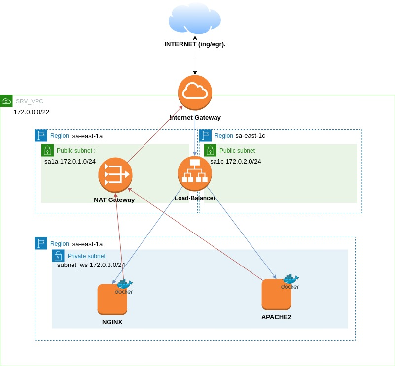

## Exercise Nimbux

### Overview:

I have used terraform to create two instances with a load balancer, which is balancing by Round Robin.
Use the amazon-linux image and install Docker on it.

---
### Architecture:
 
 ---
### Deploy:
Run the following command to deploy the instances: `terraform apply`.

---

### Outputs:
At the end, we will see the URL to access our services.